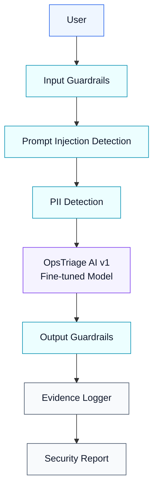

# Threat Model Diagram

## Purpose

This threat model frames OpsTriage AI v2 as a pre-production security validation layer. The core
principle is that incident text and model output are both untrusted until guardrails, validation,
evidence logging, and human review controls are applied.
