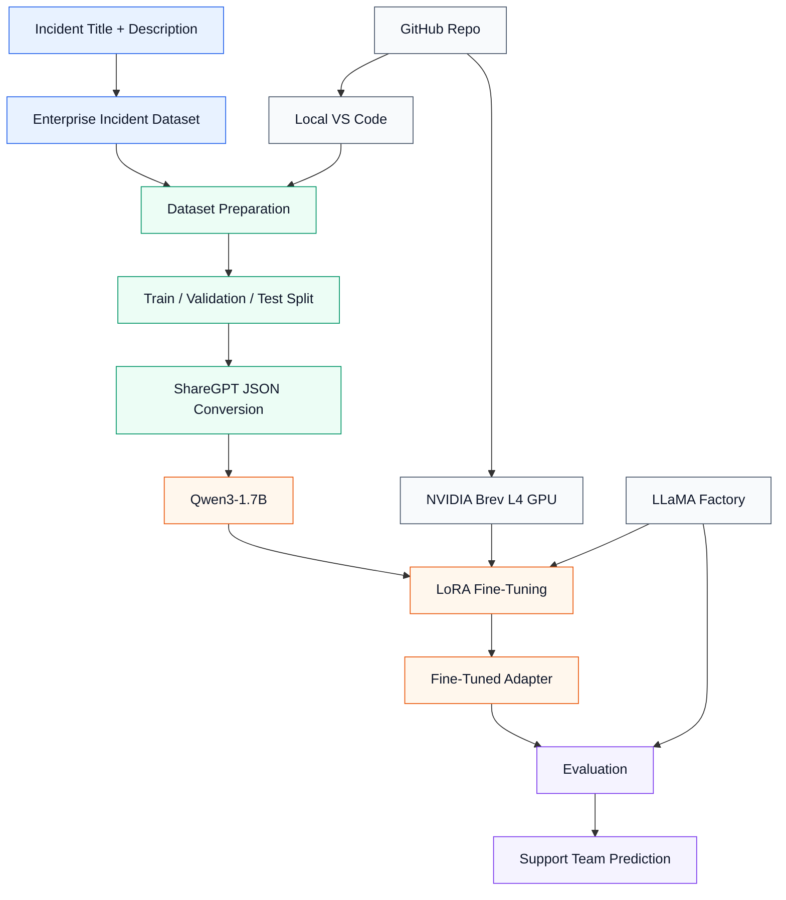

# OpsTriage AI

**AI-powered production incident decision support for enterprise support teams.**

OpsTriage AI v1 fine-tunes an open-source language model with LoRA to classify enterprise production incidents into the correct support team. The project is designed like an enterprise AI Engineering product: clear business problem, governed dataset, reproducible preparation pipeline, cloud GPU fine-tuning workflow, evaluation artifacts, and responsible human-in-the-loop positioning.

This project is inspired by real production support workflows in enterprise healthcare IT, where incident routing depends on application knowledge, support ownership, and operational context.

## Business Problem

Production incidents often enter support organizations through tools such as ServiceNow, Jira, PEGA, monitoring systems, service marketplaces, and internal portals. Before an issue can be resolved, an Incident Support Engineer must read the ticket and decide which support team should own the first investigation.

That first routing step is repetitive but important. Incorrect routing creates avoidable handoffs, delays resolution, increases operational noise, and depends heavily on experienced engineers who know the application landscape.

OpsTriage AI addresses this first-stage triage problem by recommending the most likely support team from the incident title and description. The recommendation is intended to assist engineers, not replace them.

## Why AI Instead of Only Rules

Rule-based routing is useful for deterministic policies, but it struggles when incident text is messy, incomplete, or written in different styles. Production tickets often include abbreviations, typos, business terminology, partial error messages, and symptoms that point indirectly to the owning team.

AI is better suited for the language-understanding part of the workflow:

- Recognizing similar incidents written in different words
- Learning routing patterns across applications and business domains
- Handling short, messy, or support-desk-style descriptions
- Distinguishing platform failures from application symptoms
- Ranking likely support teams when text is ambiguous

Deterministic rules still belong in the system. They should handle validation, confidence thresholds, unsupported labels, escalation policy, and human-review routing. In this architecture, the model recommends and business rules govern.

## Project Scope

Input:

- Incident title
- Incident description

Output:

- Predicted support team

Supported teams:

- Claims Engineering
- Membership Engineering
- Provider Systems
- Digital Experience
- Billing Systems
- Data Engineering
- API Platform
- Integration Services
- Infrastructure
- Database Engineering
- Identity & Access
- Security
- Reporting & Analytics
- Batch Processing
- DevOps

## High-Level Architecture



System responsibilities:

- **Incident Intake:** Accept incident title and description from a future UI, API, or batch workflow.
- **Validation:** Enforce required fields and approved support-team labels.
- **Preprocessing:** Convert incidents into supervised fine-tuning records.
- **AI Classification:** Fine-tune Qwen3-1.7B with LoRA for support-team prediction.
- **Business Rules:** Future deterministic layer for confidence thresholds, missing information, and human review.
- **Evaluation:** Track training results now and add classification-specific metrics in the next sprint.
- **Artifact Governance:** Keep model checkpoints out of Git while preserving configs, data samples, and reports.

## Dataset Overview

The current dataset is a public-safe synthetic incident dataset modeled after enterprise production support tickets.

| Item | Value |
|---|---:|
| Total records | 100 |
| Train records | 70 |
| Validation records | 15 |
| Test records | 15 |
| Format | ShareGPT/OpenAI `messages` |
| Source CSV | `data/sample/sample_incidents.csv` |
| Processed splits | `data/processed/splits/` |

The dataset includes realistic ticket patterns such as portal failures, API timeouts, claims processing issues, eligibility sync delays, database deadlocks, SFTP failures, reporting discrepancies, deployment issues, and identity/access problems.

This dataset is intentionally small for Week 5 fine-tuning and pipeline validation. Future versions should expand toward 500+ examples before making stronger production-quality claims.

## Fine-Tuning Approach

| Area | Choice |
|---|---|
| Base model | `Qwen/Qwen3-1.7B` |
| Fine-tuning method | LoRA |
| Training framework | LLaMA Factory |
| Task type | Supervised fine-tuning |
| Training environment | NVIDIA Brev |
| GPU | NVIDIA L4 |
| Adapter path | `models/checkpoints/qwen3-1.7b-lora-opstriage-v0.1.0` |

The adapter and checkpoint files are intentionally excluded from Git. The repository tracks the dataset, configuration, runbooks, and evaluation summaries needed to reproduce or review the work.

## Training Workflow

1. Prepare and validate the synthetic incident dataset locally.
2. Generate train, validation, and test ShareGPT/OpenAI JSON splits.
3. Register the dataset with LLaMA Factory using `data/dataset_info.json`.
4. Run a small smoke training pass on NVIDIA Brev.
5. Fix LLaMA Factory path and config compatibility issues.
6. Run LoRA fine-tuning on `Qwen/Qwen3-1.7B`.
7. Save the LoRA adapter outside Git.
8. Record reported training metrics and engineering lessons.

Key files:

- `scripts/prepare_dataset.py`
- `src/preprocessing/dataset_preparation.py`
- `data/dataset_info.json`
- `configs/training/llamafactory_qwen3_1_7b_lora_smoke.yaml`
- `configs/training/llamafactory_qwen3_1_7b_lora_sft.yaml`
- `docs/TrainingRunbook.md`
- `docs/FineTuningResults.md`

## Evaluation Summary

The Week 5 LLaMA Factory training run completed successfully on NVIDIA Brev.

| Metric | Value |
|---|---:|
| BLEU-4 | 36.3868 |
| ROUGE-1 | 34.7179 |
| ROUGE-2 | 29.359 |
| ROUGE-L | 34.4444 |

These are the actual sequence-generation metrics reported by the fine-tuning workflow. They are not presented as classification accuracy.

Next evaluation work should add task-specific classification metrics:

- Accuracy
- Precision
- Recall
- Macro F1
- Weighted F1
- Invalid-label rate
- Confusion matrix
- Error analysis

## Engineering Challenges Solved

- **Dataset path resolution:** LLaMA Factory resolves dataset registry paths relative to `data/`, so paths were corrected from `data/processed/splits/*.json` to `processed/splits/*.json`.
- **LLaMA Factory v0.9.5 compatibility:** Configs were updated from `generation_max_new_tokens` to `max_new_tokens`.
- **Missing local ML dependencies:** Local development did not require installing the full GPU training stack.
- **Best-model metric mismatch:** Macro F1 is not automatically available from the generation workflow, so classification-specific evaluation is planned separately.
- **YAML/config syntax issues:** Smoke training was used to uncover and fix config compatibility before full training.
- **Local Mac vs cloud GPU limitation:** The local Apple M2 Mac has 8 GB unified memory, so training was moved to NVIDIA Brev with an L4 GPU.
- **Artifact governance:** Checkpoints, adapter weights, optimizer state, scheduler state, and trainer state are excluded from Git.

## Repository Structure

```text
.
├── configs/training/          # LLaMA Factory dataset and LoRA configs
├── data/
│   ├── sample/                # Public-safe synthetic CSV dataset
│   └── processed/splits/      # ShareGPT/OpenAI train/validation/test JSON
├── docs/                      # PRD, architecture, dataset, training, and runbooks
├── outputs/
│   ├── data_quality/          # Dataset validation report
│   └── evaluation/            # Training result summaries
├── scripts/                   # Dataset preparation entry point
├── src/
│   ├── config/                # Approved support-team taxonomy
│   └── preprocessing/         # Dataset validation and formatting utilities
└── tests/                     # Unit tests for data preparation logic
```

## Key AI Engineering Skills Demonstrated

- Translating an enterprise workflow into an AI decision-support product
- Designing a supervised fine-tuning dataset and label taxonomy
- Building validation utilities for schema, labels, duplicates, and splits
- Converting tabular incident records into ShareGPT/OpenAI SFT format
- Configuring LLaMA Factory for Qwen3 LoRA fine-tuning
- Debugging cloud GPU training issues systematically
- Separating model recommendations from deterministic business rules
- Managing model artifacts safely outside Git
- Communicating limitations without overstating results

## Future Roadmap

- Expand dataset toward 500+ incidents
- Add classification-specific evaluation pipeline
- Compare fine-tuned model against rules and traditional ML baselines
- Build confusion matrix and error analysis reports
- Add confidence handling and invalid-label detection
- Add deterministic business rules for human review
- Build an inference API
- Build a Streamlit dashboard
- Add feedback capture for continuous learning

## Responsible AI Positioning

OpsTriage AI is a human-in-the-loop decision support system. It should not automatically assign production incidents without review, and it should not process real PHI, PII, credentials, proprietary logs, or confidential enterprise incidents in this public portfolio version.
