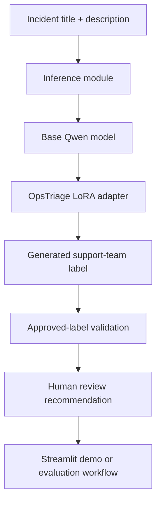

# Architecture

OpsTriage AI is designed as a modular enterprise AI system.

## Components

- Incident intake layer
- Input validation layer
- Preprocessing layer
- AI classification layer using Qwen3-1.7B plus the OpsTriage LoRA adapter
- Approved-label validation layer
- Human review recommendation layer
- Classification evaluation layer
- Streamlit demonstration layer
- Observability and audit layer
- Dataset and model versioning layer

## Architecture Principle

The model should recommend. Business rules should govern. Humans should remain accountable for final production incident routing decisions.

## Current Production-Inspired Flow

## Design Decisions

- Adapter files are excluded from Git and must be supplied in the local model checkpoint path.
- The inference module raises explicit setup errors when artifacts are missing.
- Confidence scores are not fabricated.
- Human review remains the default recommendation until calibrated confidence exists.
- Classification metrics are computed only from actual prediction files.
