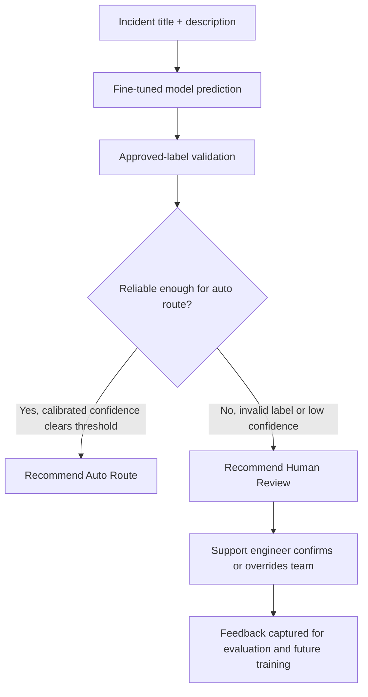

# Human-in-the-Loop Routing Workflow

OpsTriage AI is designed as decision support for incident routing, not as an unattended production
assignment system.

## Workflow

## Current Recommendation Policy

The current repository does not compute calibrated confidence. Because of that limitation, the
inference module recommends human review even when the model returns a valid support-team label.

This is intentional. A valid label proves the output is usable, but it does not prove the routing
decision is reliable enough to automate.

## Production Policy

A production deployment should only recommend auto-routing when all of these are true:

- The model returns exactly one approved support-team label.
- Calibrated confidence exceeds a threshold agreed with support leadership.
- The incident does not contain restricted data, security escalation language, or outage-critical terms.
- Recent evaluation shows acceptable precision and recall for that team.
- Human override and audit logging are available.

## Why Not Blind Automation

Enterprise incident routing affects service restoration, escalation paths, customer communication,
and operational accountability. Blind automation can create silent misroutes, delay resolution, and
erode trust in the support process.

The safer pattern is model-assisted triage:

- Let the model reduce repetitive reading and first-pass routing effort.
- Let deterministic rules enforce taxonomy, escalation, and review policy.
- Let humans remain accountable for ambiguous, high-risk, or low-confidence incidents.

## Design Decision

OpsTriage AI keeps the first production-inspired version conservative. It demonstrates the complete
AI engineering workflow while preserving the trust boundary that real enterprise teams expect.
